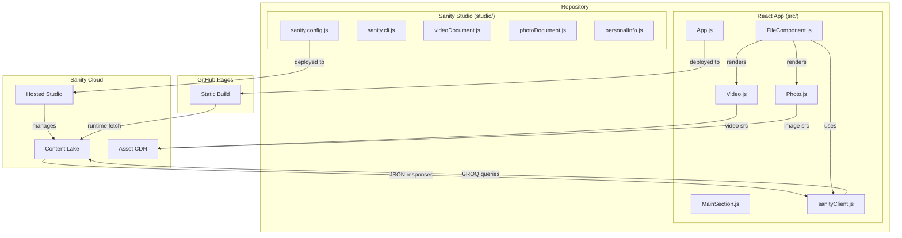

# Design Document: Sanity CMS Integration

## Overview

This design describes the integration of Sanity CMS into an existing React portfolio website (Create React App, deployed on GitHub Pages). The site currently hardcodes 11 videos and 23 photos as static files in `src/assets/videos/` and `src/assets/photos/`, rendered by `FileComponent.js`. The integration replaces these hardcoded assets with dynamic content fetched at runtime from Sanity's Content Lake via GROQ queries, while preserving all local UI assets (`src/assets/misc/`, `src/assets/profilePics/`).

The Sanity Studio will be set up as a separate directory (`studio/`) within the same repository, providing the portfolio owner with a web-based interface for uploading, removing, and reordering media. The `@sanity/orderable-document-list-plugin` enables drag-and-drop ordering. The React frontend uses `@sanity/client` to fetch content client-side, keeping the site fully compatible with GitHub Pages (no SSR, no build-time data fetching).

## Architecture



### Key Architectural Decisions

1. **Separate Studio directory**: The Sanity Studio lives in `studio/` at the repo root with its own `package.json`. This keeps the CRA build pipeline untouched and avoids dependency conflicts between `react-scripts` and Sanity's Vite-based Studio.

2. **Client-side fetching only**: All CMS content is fetched at runtime via `@sanity/client` in the browser. No SSR or static generation. This is required for GitHub Pages compatibility.

3. **CDN for reads**: The Sanity client is configured with `useCdn: true` for fast, cached reads of published content.

4. **Environment variables**: Sanity project ID and dataset are stored in `REACT_APP_*` environment variables, following CRA conventions.

5. **Graceful degradation**: If the Sanity API is unreachable, the site renders without media content rather than crashing.

## Components and Interfaces

### New Modules

#### 1. `src/sanityClient.js` — Sanity Client Configuration

Exports a configured `@sanity/client` instance and a GROQ query helper.

```js
// src/sanityClient.js
import { createClient } from "@sanity/client";

export const client = createClient({
  projectId: process.env.REACT_APP_SANITY_PROJECT_ID,
  dataset: process.env.REACT_APP_SANITY_DATASET,
  apiVersion: "2024-01-01",
  useCdn: true,
});
```

#### 2. `src/hooks/useSanityData.js` — Custom Data Fetching Hook

A reusable React hook that encapsulates GROQ query execution, loading state, and error handling.

```js
// src/hooks/useSanityData.js
import { useState, useEffect } from "react";
import { client } from "../sanityClient";

export function useSanityData(query) {
  const [data, setData] = useState([]);
  const [loading, setLoading] = useState(true);
  const [error, setError] = useState(null);

  useEffect(() => {
    client
      .fetch(query)
      .then((result) => {
        setData(result);
        setLoading(false);
      })
      .catch((err) => {
        setError(err);
        setLoading(false);
      });
  }, [query]);

  return { data, loading, error };
}
```

#### 3. Sanity Studio Schemas

##### `studio/schemas/videoDocument.js`

```js
import { orderRankField } from "@sanity/orderable-document-list";

export default {
  name: "videoDocument",
  title: "Video",
  type: "document",
  fields: [
    {
      name: "title",
      title: "Title",
      type: "string",
      validation: (Rule) => Rule.required(),
    },
    {
      name: "videoFile",
      title: "Video File",
      type: "file",
      validation: (Rule) => Rule.required(),
    },
    {
      name: "fileName",
      title: "File Name",
      type: "string",
      description:
        "Display name shown in the file list (e.g., jobandikas--wakandaForever.mp4)",
      validation: (Rule) => Rule.required(),
    },
    { name: "youtubeLink", title: "YouTube Link", type: "url" },
    orderRankField({ type: "videoDocument" }),
  ],
};
```

##### `studio/schemas/photoDocument.js`

```js
import { orderRankField } from "@sanity/orderable-document-list";

export default {
  name: "photoDocument",
  title: "Photo",
  type: "document",
  fields: [
    {
      name: "image",
      title: "Image",
      type: "image",
      validation: (Rule) => Rule.required(),
    },
    {
      name: "caption",
      title: "Caption",
      type: "string",
      description: "Optional caption for the photo",
    },
    orderRankField({ type: "photoDocument" }),
  ],
};
```

##### `studio/schemas/personalInfo.js`

This schema uses the singleton document pattern — a single document with a fixed `_id` so only one instance can exist. The Studio structure is configured to edit this document directly rather than showing a list view.

```js
export default {
  name: "personalInfo",
  title: "Personal Information",
  type: "document",
  // Singleton: only allow creation via the structure builder with a fixed ID
  fields: [
    {
      name: "email",
      title: "Email",
      type: "string",
      validation: (Rule) =>
        Rule.required().regex(
          /^[a-zA-Z0-9._%+-]+@[a-zA-Z0-9.-]+\.[a-zA-Z]{2,}$/,
          { name: "email", invert: false },
        ),
    },
    {
      name: "instagramName",
      title: "Instagram Name",
      type: "string",
      description: "Display name for Instagram (e.g., @username)",
    },
    {
      name: "instagramUrl",
      title: "Instagram URL",
      type: "url",
    },
    {
      name: "youtubeName",
      title: "YouTube Name",
      type: "string",
      description: "Display name for YouTube channel",
    },
    {
      name: "youtubeUrl",
      title: "YouTube URL",
      type: "url",
    },
  ],
};
```

##### Singleton Pattern in `studio/sanity.config.js`

The `personalInfo` document uses a fixed document ID (`personalInfo`) and is rendered as a direct editor in the Studio structure, preventing creation of multiple instances:

```js
import personalInfo from "./schemas/personalInfo";

// In the structure builder, add:
S.listItem()
  .title("Personal Information")
  .child(
    S.document()
      .schemaType("personalInfo")
      .documentId("personalInfo")
  ),

// In schema.types, add personalInfo to the array:
schema: {
  types: [videoDocument, photoDocument, personalInfo],
}
```

### Modified Modules

#### `src/components/FileComponent.js` — Refactored for Dynamic Content

The current `FileComponent` hardcodes `videoArray`, `ytArray`, and `imgTotal`. The refactored version:

- Uses `useSanityData` hook to fetch Video_Document and Photo_Document entries
- Sorts results by `orderRank` ascending (handled in GROQ query)
- Renders a loading indicator while fetching
- Renders an empty state message when no results are returned
- Constructs CDN URLs from Sanity file/image references
- Falls back gracefully on fetch errors

GROQ queries:

```groq
// Videos (ordered by orderRank)
*[_type == "videoDocument"] | order(orderRank asc) {
  _id, title, fileName, "videoUrl": videoFile.asset->url, youtubeLink, orderRank
}

// Photos (ordered by orderRank)
*[_type == "photoDocument"] | order(orderRank asc) {
  _id, "imageUrl": image.asset->url, caption, orderRank
}

// Personal Info (singleton)
*[_id == "personalInfo"][0] {
  email, instagramName, instagramUrl, youtubeName, youtubeUrl
}
```

### Unchanged Modules

The following components require no changes:

- `Video.js` — Already accepts `url`, `title`, `yt` props. CDN URLs work as drop-in replacements.
- `Photo.js` — Already accepts `url` prop. CDN image URLs work as drop-in replacements.
- `App.js` — State management and component composition remain the same.
- `MainSection.js` — Passes props to `FileComponent` unchanged.
- `TabSection.js`, `HeaderSection.js`, `IconSection.js`, `LeftSection.js`, `Contact.js` — No CMS interaction.
- All assets in `src/assets/misc/` and `src/assets/profilePics/` — Remain local.

## Data Models

### Sanity Document Schemas

#### Video_Document

| Field         | Type     | Required   | Description                                                                    |
| ------------- | -------- | ---------- | ------------------------------------------------------------------------------ |
| `title`       | `string` | Yes        | Display name of the video (e.g., "freddieGibbs")                               |
| `videoFile`   | `file`   | Yes        | Uploaded video file, served via Sanity CDN                                     |
| `fileName`    | `string` | Yes        | Display name shown in the file list (e.g., "jobandikas--wakandaForever.mp4")   |
| `youtubeLink` | `url`    | No         | Optional YouTube URL for the video                                             |
| `orderRank`   | `string` | Yes (auto) | Managed by `@sanity/orderable-document-list-plugin` for drag-and-drop ordering |

#### Photo_Document

| Field       | Type     | Required   | Description                                                                    |
| ----------- | -------- | ---------- | ------------------------------------------------------------------------------ |
| `image`     | `image`  | Yes        | Uploaded photo, served via Sanity CDN                                          |
| `caption`   | `string` | No         | Optional caption for the photo                                                 |
| `orderRank` | `string` | Yes (auto) | Managed by `@sanity/orderable-document-list-plugin` for drag-and-drop ordering |

#### Personal_Info_Document

| Field           | Type     | Required | Description                                            |
| --------------- | -------- | -------- | ------------------------------------------------------ |
| `_id`           | `string` | Yes      | Fixed to `"personalInfo"` to enforce singleton pattern |
| `email`         | `string` | Yes      | Portfolio owner's contact email address                |
| `instagramName` | `string` | No       | Display name for Instagram (e.g., "@username")         |
| `instagramUrl`  | `url`    | No       | Full Instagram profile URL                             |
| `youtubeName`   | `string` | No       | Display name for YouTube channel                       |
| `youtubeUrl`    | `url`    | No       | Full YouTube channel URL                               |

### GROQ Response Shapes

#### Video Query Response

```json
[
  {
    "_id": "abc123",
    "title": "freddieGibbs",
    "fileName": "jobandikas--wakandaForever.mp4",
    "videoUrl": "https://cdn.sanity.io/files/{projectId}/{dataset}/{fileHash}.mp4",
    "youtubeLink": "https://www.youtube.com/watch?v=AjWSlrg21Yg",
    "orderRank": "0|aaaaaa:"
  }
]
```

#### Photo Query Response

```json
[
  {
    "_id": "def456",
    "imageUrl": "https://cdn.sanity.io/images/{projectId}/{dataset}/{imageHash}.jpg",
    "caption": "Behind the scenes at the studio",
    "orderRank": "0|aaaaaa:"
  }
]
```

#### Personal Info Query Response

```json
{
  "_id": "personalInfo",
  "email": "[email]",
  "instagramName": "@username",
  "instagramUrl": "https://www.instagram.com/username",
  "youtubeName": "Channel Name",
  "youtubeUrl": "https://www.youtube.com/@channelname"
}
```

### Environment Variables

| Variable                      | Description               | Example      |
| ----------------------------- | ------------------------- | ------------ |
| `REACT_APP_SANITY_PROJECT_ID` | Sanity project identifier | `abc123de`   |
| `REACT_APP_SANITY_DATASET`    | Sanity dataset name       | `production` |

### File Structure (New/Modified)

```
repo/
├── .env.example                    # NEW: documents required env vars
├── .gitignore                      # MODIFIED: add .env
├── src/
│   ├── sanityClient.js             # NEW: Sanity client config
│   ├── hooks/
│   │   └── useSanityData.js        # NEW: data fetching hook
│   └── components/
│       └── FileComponent.js        # MODIFIED: dynamic CMS fetching
└── studio/                         # NEW: Sanity Studio
    ├── package.json
    ├── sanity.config.js
    ├── sanity.cli.js
    └── schemas/
        ├── videoDocument.js
        ├── photoDocument.js
        └── personalInfo.js
```

## Correctness Properties

_A property is a characteristic or behavior that should hold true across all valid executions of a system — essentially, a formal statement about what the system should do. Properties serve as the bridge between human-readable specifications and machine-verifiable correctness guarantees._

### Property 1: Video title validation rejects empty/whitespace strings

_For any_ string composed entirely of whitespace characters (including the empty string), the Video_Document title validation rule should reject it, and for any non-empty string containing at least one non-whitespace character, the validation should accept it.

**Validates: Requirements 2.2**

### Property 2: YouTube link validation accepts only valid URLs

_For any_ string provided as a YouTube link value, the Video_Document URL validation should accept it if and only if it is a syntactically valid URL. For any string that is not a valid URL, the validation should reject it.

**Validates: Requirements 2.3**

### Property 3: Media documents are rendered in orderRank ascending order

_For any_ list of media documents (Video_Document or Photo_Document) with arbitrary `orderRank` string values, the FileComponent should render them in ascending lexicographic order of `orderRank`. That is, for every pair of adjacent rendered items, the first item's `orderRank` should be less than or equal to the second item's `orderRank`.

**Validates: Requirements 5.3, 5.4**

### Property 4: Fetch errors result in graceful degradation

_For any_ error thrown by the Sanity client during a GROQ fetch, the `useSanityData` hook should return an error state with an empty data array and `loading: false`, and the FileComponent should render without crashing (no uncaught exceptions).

**Validates: Requirements 6.4**

### Property 5: Video document rendering includes all required fields

_For any_ list of Video_Document objects each containing a `title`, `videoUrl`, `fileName`, and `youtubeLink`, the FileComponent (type="video") should render an element for each document where the title text is present in the rendered output, the fileName is displayed in the file list, and the video URL is used as the source for playback.

**Validates: Requirements 7.2**

### Property 6: Photo document rendering uses CDN image URLs

_For any_ list of Photo_Document objects each containing an `imageUrl` and optional `caption`, the FileComponent (type="photo") should render a clickable thumbnail for each document where the `imageUrl` is used as the image source and the `caption` is available for rendering when provided.

**Validates: Requirements 8.2**

## Codebase Hardening Design

### Security Fixes

#### 1. XSS Prevention in LeftSection Comments

User-submitted comments are currently rendered directly via `{comments[i]}`. To prevent XSS, all comment text must be sanitized before being stored in state. A simple approach: strip HTML tags using a utility function before adding to the comments array.

```js
// src/utils/sanitize.js
export function sanitizeText(input) {
  const div = document.createElement("div");
  div.textContent = input;
  return div.innerHTML;
}
```

Apply in `LeftSection.js` `commentHandle`:

```js
const commentHandle = (c) => {
  setComments([...comments, sanitizeText(c)]);
  setInputValue("");
};
```

#### 2. YouTube URL Validation in Video Component

Before calling `window.open`, validate the URL matches expected YouTube domains:

```js
const handleYoutube = () => {
  try {
    const url = new URL(props.yt);
    if (
      url.hostname === "www.youtube.com" ||
      url.hostname === "youtube.com" ||
      url.hostname === "youtu.be"
    ) {
      window.open(props.yt, "_blank", "noopener,noreferrer");
    }
  } catch {
    // Invalid URL, do nothing
  }
};
```

#### 3. Replace Direct DOM Manipulation with React Refs

In `FileComponent.js`, the active file highlighting uses `document.querySelectorAll` and `document.getElementById`. Replace with React state tracking:

```js
const [activeFile, setActiveFile] = useState(null);
// In render: className={"file-name" + (activeFile === videoArray[i] ? " active" : "")}
```

Similarly in `Video.js`, the exit handler should call a callback prop rather than querying the DOM.

#### 4. Package.json Private Flag

Set `"private": true` in `package.json` to prevent accidental `npm publish`.

### Performance Fixes

#### 1. AudioMotionAnalyzer Cleanup

The `useEffect` in `Video.js` creates an `AudioMotionAnalyzer` but never destroys it. Store the instance and call `destroy()` on unmount:

```js
useEffect(() => {
  const analyzer = new AudioMotionAnalyzer(visualizerRef.current, { ... });
  return () => analyzer.destroy();
}, []);
```

#### 2. Lazy Loading Photo Thumbnails

Add `loading="lazy"` to photo thumbnail `` elements in `FileComponent.js`:

```jsx

```

### Accessibility Fixes

#### 1. Descriptive Alt Text

Replace all `alt="uh oh"` with meaningful descriptions:

- Video logos: `alt="Video file icon"`
- Photo thumbnails: `alt="Photo thumbnail {i+1}"`
- Profile pics: `alt="Profile picture for {username}"`
- Contact images: `alt="Left fingerprint scan"`, `alt="Face scan animation"`, etc.

#### 2. Keyboard Navigation for File Items

Wrap clickable file items in `<button>` elements or add `tabIndex={0}`, `role="button"`, and `onKeyDown` handlers:

```jsx
<div
  className="file-icon-container"
  role="button"
  tabIndex={0}
  aria-label={`Play video ${videoArray[i]}`}
  onClick={...}
  onKeyDown={(e) => { if (e.key === "Enter" || e.key === " ") { ... } }}
>
```

#### 3. ARIA Labels on Custom Buttons

Add `aria-label` to icon-only buttons:

- `<button id="video-exit" aria-label="Close video player">`
- `<button id="photo-exit" aria-label="Close photo viewer">`
- `<button id="pause-play-button" aria-label="Pause or play video">`

### Code Quality Fixes

#### 1. Error Boundary Component

```js
// src/components/ErrorBoundary.js
import React from "react";

class ErrorBoundary extends React.Component {
  constructor(props) {
    super(props);
    this.state = { hasError: false };
  }
  static getDerivedStateFromError() {
    return { hasError: true };
  }
  componentDidCatch(error, info) {
    console.error("ErrorBoundary caught:", error, info);
  }
  render() {
    if (this.state.hasError) {
      return (
        <div style={{ color: "white", padding: "20px" }}>
          Something went wrong. Please refresh the page.
        </div>
      );
    }
    return this.props.children;
  }
}
export default ErrorBoundary;
```

Wrap `<App />` in `index.js`:

```js
root.render(
  <ErrorBoundary>
    <App />
  </ErrorBoundary>,
);
```

#### 2. Strict Equality and Deprecated API Cleanup

- Replace `i == comments.length - 1` with `i === comments.length - 1` in `LeftSection.js`
- Replace `inputValue != ""` with `inputValue !== ""` in `LeftSection.js`
- Remove `e.keyCode === 13` check, keep only `e.key === "Enter"`

### Property 7: Comment text sanitization prevents HTML injection

_For any_ string containing HTML tags or script elements, the sanitizeText function should return a string where all HTML special characters are escaped, and the output when rendered as text content does not execute scripts or create DOM elements.

**Validates: Requirements 12.2**

### Property 8: Personal info email validation accepts only valid email addresses

_For any_ string provided as an email value, the Personal_Info_Document email validation should accept it if and only if it matches the email regex pattern. For any string that does not match, the validation should reject it.

**Validates: Requirements 13.3**

## Error Handling

### Sanity Client Fetch Errors

| Scenario                                 | Behavior                                                                                                                                                |
| ---------------------------------------- | ------------------------------------------------------------------------------------------------------------------------------------------------------- |
| Network timeout / Sanity API unreachable | `useSanityData` sets `error` state; FileComponent renders empty state with a user-friendly message (e.g., "Unable to load content") instead of crashing |
| Invalid project ID or dataset            | Same as above — caught by the `.catch()` handler in the hook                                                                                            |
| GROQ query syntax error                  | Caught by `.catch()` handler; logged to console; empty state rendered                                                                                   |
| Empty result set (no documents)          | Not an error — `data` is `[]`, `loading` is `false`; FileComponent renders an empty state message (e.g., "No videos yet" / "No photos yet")             |

### Environment Variable Errors

| Scenario                              | Behavior                                                                                                                |
| ------------------------------------- | ----------------------------------------------------------------------------------------------------------------------- |
| Missing `REACT_APP_SANITY_PROJECT_ID` | Sanity client instantiates with `undefined` project ID; all fetches fail; graceful degradation via error handling above |
| Missing `REACT_APP_SANITY_DATASET`    | Same as above                                                                                                           |

### Schema Validation Errors (Studio-side)

| Scenario                      | Behavior                                                                  |
| ----------------------------- | ------------------------------------------------------------------------- |
| Empty video title             | Sanity Studio shows inline validation error; document cannot be published |
| Invalid YouTube URL           | Sanity Studio shows inline validation error on the URL field              |
| Missing required video file   | Sanity Studio prevents publishing until a file is uploaded                |
| Missing required photo image  | Sanity Studio prevents publishing until an image is uploaded              |
| Empty or invalid email        | Sanity Studio shows inline validation error on the email field            |
| Invalid Instagram/YouTube URL | Sanity Studio shows inline validation error on the URL field              |

## Testing Strategy

### Dual Testing Approach

Both unit tests and property-based tests are required for comprehensive coverage.

### Unit Tests

Unit tests cover specific examples, edge cases, integration points, and structural checks:

- **Sanity client configuration**: Verify `createClient` is called with correct env vars, `useCdn: true`, and correct API version (Requirements 6.1, 6.2, 6.3, 11.1)
- **Schema structure**: Verify Video_Document and Photo_Document schemas have correct field names, types, and validation rules (Requirements 2.1, 3.1)
- **Loading state**: Verify FileComponent shows a loading indicator while `useSanityData` returns `loading: true` (Requirements 7.4, 8.4)
- **Empty state**: Verify FileComponent shows an empty state message when data is `[]` (Requirements 7.5, 8.5)
- **Video click handler**: Verify clicking a video entry calls `playVideo(true)` and `setUrl` with the CDN URL (Requirement 7.3)
- **Photo click handler**: Verify clicking a photo entry calls `showPhoto(true)` and `setUrl` with the CDN URL (Requirement 8.3)
- **Static asset preservation**: Verify `Contact.js`, `IconSection.js`, `LeftSection.js` still reference local `src/assets/` paths and do not import `sanityClient` (Requirements 9.1, 9.2, 9.3)
- **Environment file**: Verify `.env.example` exists with `REACT_APP_SANITY_PROJECT_ID` and `REACT_APP_SANITY_DATASET` (Requirement 11.2)
- **Gitignore**: Verify `.gitignore` contains `.env` (Requirement 11.3)
- **Plugin registration**: Verify `sanity.config.js` imports and registers `orderableDocumentListDeskItem` (Requirement 1.3)

### Property-Based Tests

Property-based tests use `fast-check` (a JavaScript property-based testing library) to verify universal properties across randomly generated inputs. Each test runs a minimum of 100 iterations.

| Property   | Test Description                                                                                                                                               | Tag                                                                                                              |
| ---------- | -------------------------------------------------------------------------------------------------------------------------------------------------------------- | ---------------------------------------------------------------------------------------------------------------- |
| Property 1 | Generate random whitespace-only strings and verify title validation rejects them; generate random strings with non-whitespace chars and verify acceptance      | `Feature: sanity-cms-integration, Property 1: Video title validation rejects empty/whitespace strings`           |
| Property 2 | Generate random valid URLs and invalid strings; verify URL validation accepts/rejects correctly                                                                | `Feature: sanity-cms-integration, Property 2: YouTube link validation accepts only valid URLs`                   |
| Property 3 | Generate random lists of media documents with arbitrary orderRank strings; verify rendered order is ascending by orderRank                                     | `Feature: sanity-cms-integration, Property 3: Media documents are rendered in orderRank ascending order`         |
| Property 4 | Generate random Error objects; verify useSanityData hook returns error state with empty data and FileComponent renders without throwing                        | `Feature: sanity-cms-integration, Property 4: Fetch errors result in graceful degradation`                       |
| Property 5 | Generate random lists of video document objects with random titles, fileName values, URLs, and YouTube links; verify all fields appear in rendered output      | `Feature: sanity-cms-integration, Property 5: Video document rendering includes all required fields`             |
| Property 6 | Generate random lists of photo document objects with random image URLs and optional captions; verify each imageUrl is used as an img src in rendered output    | `Feature: sanity-cms-integration, Property 6: Photo document rendering uses CDN image URLs`                      |
| Property 7 | Generate random strings containing HTML tags and script elements; verify sanitizeText escapes all HTML special characters and output does not contain raw HTML | `Feature: sanity-cms-integration, Property 7: Comment text sanitization prevents HTML injection`                 |
| Property 8 | Generate random strings matching and not matching email patterns; verify email validation accepts/rejects correctly                                            | `Feature: sanity-cms-integration, Property 8: Personal info email validation accepts only valid email addresses` |

### Test Configuration

- **Library**: `fast-check` for property-based testing
- **Runner**: Jest (already configured via `react-scripts test`)
- **Minimum iterations**: 100 per property test
- **Each property test must be implemented as a single property-based test**
- **Each test must include a comment referencing the design property using the tag format above**
